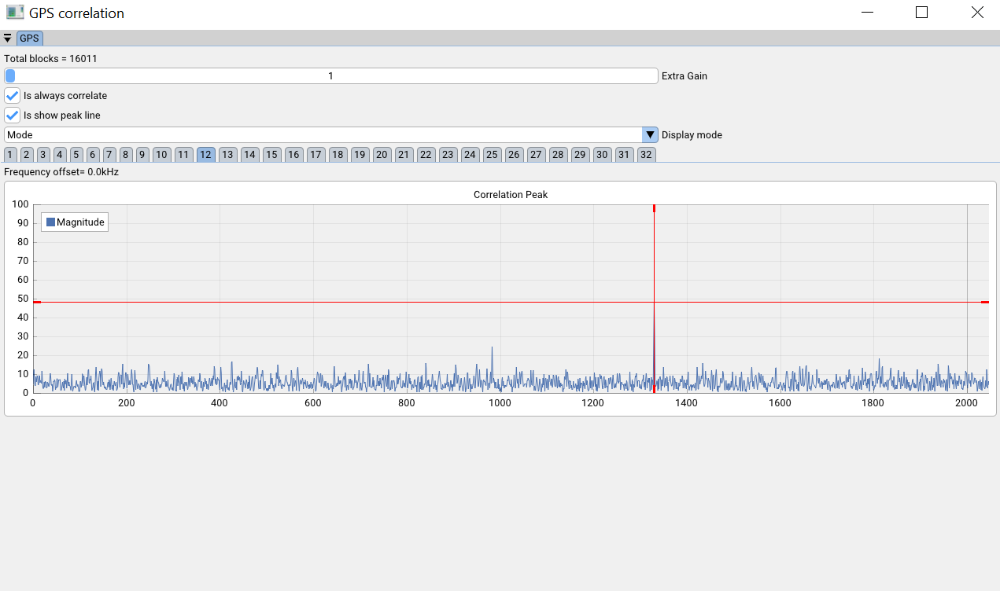

# Introduction
Displays the correlation peaks when attempting to acquire a GPS signal.

Useful to debug in realtime whether a gps signal is present allowing for quick adjustments to location or orientation of antenna. 

This is quite useful when using software like [GNSS-SDRLIB](https://github.com/taroz/GNSS-SDRLIB) which doesn't expose this data in realtime. Instead limited information is only shown in a text window which only updates every few seconds.

This is not GPS decoding software, it is only used for testing whether or not your gps receiver has a valid signal.

# Gallery

# Useful links
1. How GPS PRN codes are generated [link](https://natronics.github.io/blag/2014/gps-prn)
2. How GPS spread codes work [link](https://natronics.github.io/blag/2014/gps-spreading/)
3. Instructions for running SDR software for decoding GPS signals [youtube-link](https://www.youtube.com/watch?v=YG2fJRTAoHA)
